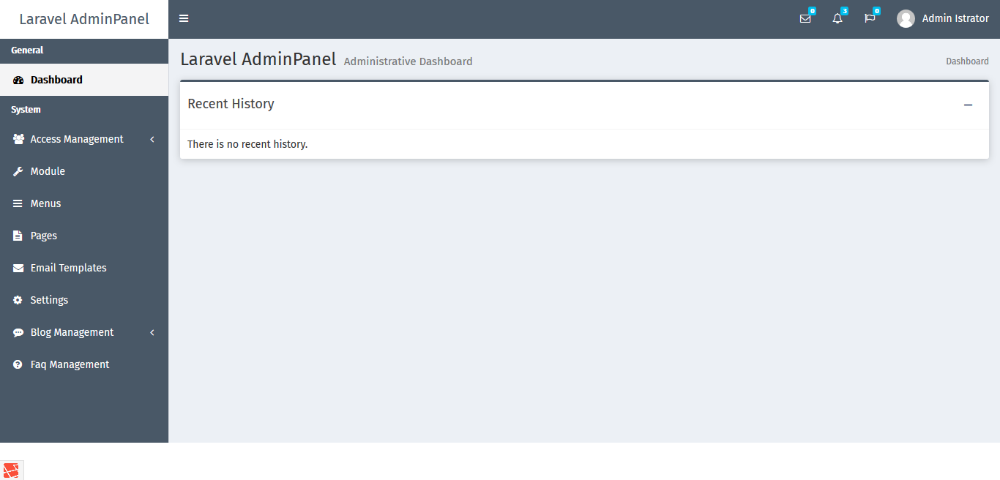
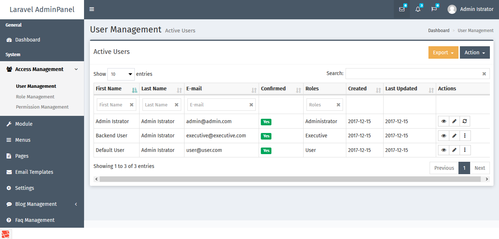
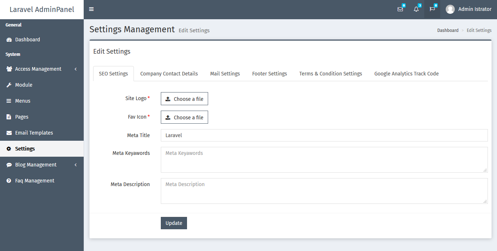

# Walter system

## Additional Features
* Built-in Laravel Boilerplate Module Generator,
* Dynamic Menu/Sidebar Builder
* Pages Module
* Blog Module
* FAQ Module
* API Boilerplate
* Mailables
* Responses
* Vue Components
* Laravel Mix
* Object based javascript Implementation

**Command list**

    git clone https://github.com/walternguyen07/wsystem.git
    cd laravel-adminpanel
    cp .env.example .env
    composer install
    npm install
    npm run development
    php artisan storage:link
    php artisan key:generate
    php artisan passport:install
    php artisan vendor:publish --tag=lfm_public
    php artisan migrate
    php artisan passport:install

## Please note

- To run test cases, add SQLite support to your php

## Other Important Commands
- To fix php coding standard issues run - composer format
- To perform various self diagnosis tests on your Laravel application. run - php artisan self-diagnosis
- To clear all cache run - composer clear-all
- To built Cache run - composer cache-all
- To clear and built cache run - composer cc

## Logging In

`php artisan db:seed` adds three users with respective roles. The credentials are as follows:

* Administrator: `admin@admin.com`
Password: `1234`

## ScreenShots

## Dashboard

## User Listing

## Settings

## Issues
## License

[MIT LICENSE](https://github.com/viralsolani/laravel-adminpanel/blob/master/LICENSE.txt)
